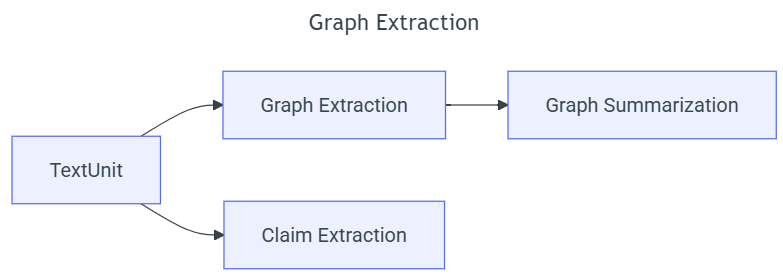

# GraphRAG 작동 원리 (Microsoft GraphRAG)

> 업데이트: 2026-02-15  
> 목적: GraphRAG가 “문서 → KG/커뮤니티 → (global/local) 검색”으로 이어지는 전체 흐름을 **데이터 모델 + 알고리즘** 관점에서 정리

---

## 0. TL;DR

- GraphRAG는 **문서에서 엔티티/관계 기반 그래프(KG)를 만들고**, 그래프 커뮤니티(군집)를 계층적으로 구성한 다음,  
  커뮤니티 단위로 미리 생성한 **community report(요약/보고서)**를 검색/조합해 답을 만든다.
- “코퍼스 전체를 관통하는 질문(예: 주요 테마/트렌드)”은 **Global Search(map-reduce)**로,  
  “특정 엔티티 중심 질문(예: A는 누구? A-B 관계?)”은 **Local Search(entity-based reasoning)**로 푼다.

---

## 1. 왜 GraphRAG인가? (기존 RAG의 약점 보완)

GraphRAG 문서에서 강조하는 포인트:
- Baseline RAG는 “데이터셋 전체를 종합해야 하는 추상 질문(예: top themes)”에서 약하다.  
  벡터 검색은 "질의와 유사한 텍스트"를 찾는 데는 강하지만, **질의에 키워드가 없거나 전역 요약이 필요한 경우** 방향을 잃기 쉽다.
- GraphRAG는 "LLM이 만든 지식 그래프 구조(= 데이터의 구조/테마)"를 이용해 전역 질문에 대응한다.

---

## 2. 용어/데이터 모델(Outputs 기준 Glossary)

GraphRAG는 인덱싱 결과를 여러 테이블(parquet)로 저장한다. 모든 테이블에는 공통적으로:
- `id`(UUID) + `human_readable_id`(run 단위의 짧은 정수 ID) 가 존재한다.  
  `human_readable_id`는 요약/답변에서 인용을 쉽게 하려는 목적이 있다.

### 핵심 개체들

| 용어 | 의미 | 활용 |
|---|---|---|
| **Document** | 원문 문서 | provenance(추적), 응용 |
| **Text Unit** | 문서를 토큰 기준으로 chunking한 청크 | graph/claim 추출의 입력, local search의 근거 |
| **Entity** | (title, type, description) 형태의 노드 | local search seed, KG 노드 |
| **Relationship** | (source, target, description) 형태의 엣지 | local search 후보, 커뮤니티 구성 |
| **Community** | 엔티티 그래프 커뮤니티(계층 구조) | global search의 핵심 조직 단위 |
| **Community Report** | 커뮤니티별 요약/보고서(summary/full_content/findings 등) | global search의 컨텍스트 |
| **Covariates (Claims)** | (옵션) claim 추출 결과(주장/행동 레코드) | local search 후보, 리포트 구성에 포함 가능 |

> `covariates.status`는 LLM이 평가한 correctness로 [TRUE, FALSE, SUSPECTED] 중 하나다.

---

## 3. Indexing(문서 → KG → 커뮤니티/리포트) 과정

GraphRAG 기본 파이프라인(“default dataflow”)을 요약하면 다음 6단계다.

### Phase 1: Compose Text Units (문서 → 텍스트 청크)
- 문서를 여러 개의 **Text Unit**으로 chunk, chunk size는 token 기준으로 설정 가능 
- `text_units` : {`text`, `n_tokens`, `document_id`, *entity_ids, relationship_ids, covariate_ids*}

> italic items은 추후 연결됨.  
> TextUnit은 이후 모든 추출 결과가 “어디서 나왔는지(provenance)”를 추적하는 source reference로 사용

### Phase 2: Document Processing
- `documents` 테이블을 만들고, document - text_units 연결을 만든다(주로 provenance 목적).
- 결과 테이블 : `documents`
  - `title`, `text`, `text_unit_ids`, `metadata`

### Phase 3: Graph Extraction
각 TextUnit에서 “그래프 기본 요소(primitives)”를 뽑는다.



#### **3-1) Entity & Relationship Extraction**
- 각 TextUnit을 대상으로 LLM을 프롬프트해서, subgraph-per-TextUnit 형태로 추출
  - entity: `{title, type, description}`
  - relationship: `{source, target, relationship_description, relationship_strength}`
    - `relationship_description` : 왜 관련있는지 설명
    - `relationship_strength` : 관련성 점수 (few-shot에서는 보통 2-9), Leiden 커뮤니티 계산 시 중요
  - TextUnit 내의 모든 entity, relationship을 각각 하나의 집합으로 모아서 저장
- 이후 subgraph들을 merge:
  - entity는 `(title, type)`가 같으면 description을 배열로 누적
  - relationship은 `(source, target)`이 같으면 description을 배열로 누적
> 이 과정을 **Entity Resolution**이라 하는데,  
> 사실상 (title, type) **exact** match을 사용하므로, 여러 노드로 나눠질 수 있음. 

#### **3-2) Entity & Relationship Summarization**
- 위에서 병합된 description 배열을 기준으로 **단일 concise description**을 생성.
- LLM에게 각 설명에서의 서로 다른 정보를 모두 포착하는 짧은 요약을 만들게 해서, **엔티티/관계마다** 단일 concise description을 갖게 한다.

#### **3-3) Claim Extraction** (optional)
- (독립 워크플로) claims를 추출해서 covariates로 저장한다.
- 문서 정의: claims는 “positive factual statements”이며 status/time-bounds를 가진다.
- claim extraction은 기본적으로 OFF이며 보통 prompt tuning이 필요하다고 안내한다.

### Phase 4: Graph Augmentation (커뮤니티 계층 생성)
- 엔티티 그래프에 **Hierarchical Leiden**으로 커뮤니티 계층을 만든다.
- 커뮤니티 크기가 threshold 이하가 될 때까지 재귀적으로 클러스터링한다.

### Phase 5: Community Summarization (커뮤니티 리포트 생성)
- 각 커뮤니티(레벨별 포함)에 대해 LLM이 **community report**를 생성한다.
- report는 해당 커뮤니티 서브구조의 핵심 entities/relationships/claims를 참조한다.
- 또한 shorthand로 쓰기 위한 `summary`도 별도로 생성한다.

### Phase 6: Text Embeddings
- downstream vector search를 위해 임베딩을 생성한다.
- 기본적으로 entity descriptions, text unit text, community report text를 임베딩한다.

#### Indexing 전체 다이어그램(mermaid)
```mermaid
flowchart LR
  D[Documents] --> TU[TextUnits (chunks)]
  TU --> GE[Extract Entities/Relationships]
  GE --> GS[Summarize entity/rel descriptions]
  TU --> CE[Claim extraction (optional)]
  GS --> GT[Graph tables: entities/relationships/(covariates)]
  GT --> CD[Hierarchical Leiden community detection]
  CD --> C[communities table]
  C --> CR[community_reports (summary/full_content)]
  TU --> EMB1[text unit embeddings]
  GS --> EMB2[entity/rel description embeddings]
  CR --> EMB3[community report embeddings]
```

---

## 4. Query Engine: Global Search vs Local Search

GraphRAG는 “질의 유형”을 크게 두 가지로 나눠서 처리한다.

---

## 4.1 Global Search (Whole Dataset Reasoning, map-reduce)

### 핵심 아이디어
- 그래프 커뮤니티 계층의 **특정 level에서 생성된 community reports 컬렉션**을 컨텍스트 데이터로 사용한다.
- 이를 **map-reduce**로 처리해서 “전역 요약/종합 답변”을 만든다.

### 알고리즘 개요
1) 입력: User Query + (옵션) Conversation History
2) **지정한 level의 community reports**를 가져옴
3) map 단계:
   - community reports를 “pre-defined size”의 text chunk로 분절
   - 각 chunk마다 **Rated Intermediate Response** 생성:
     - point 리스트 + 각 point의 중요도 rating(숫자)
4) reduce 단계:
   - intermediate responses에서 **중요한 points를 필터링/집계(Ranking + Filtering)**
   - aggregated points를 컨텍스트로 최종 답 생성

### Intermediate response(개념 예시)
```json
{
  "points": [
    {"description": "핵심 관찰 1 ...", "score": 85},
    {"description": "핵심 관찰 2 ...", "score": 72}
  ]
}
```

### 튜닝 포인트(설계 노브)
- `community level` 선택: 낮은 레벨(더 상세)일수록 thorough하지만 비용↑ 가능
- `max_data_tokens`: 컨텍스트 토큰 예산
- map/reduce 프롬프트, 병렬성(concurrency)

---

## 4.2 Local Search (Entity-based Reasoning)

### 핵심 아이디어
- 질의에 대해 **의미적으로 관련된 엔티티들을 먼저 찾고**, 그 엔티티들을 “그래프 접근점(access points)”으로 삼아,
- 그래프와 문서 청크에서 관련 정보를 모아 **단일 컨텍스트 윈도우**를 구성한 뒤,
- LLM이 답을 생성한다.

### 알고리즘 개요
1) 입력: User Query + (옵션) Conversation History
2) **Entity Description Embedding**으로 관련 엔티티(Extracted Entities) 선택
3) 후보 수집:
   - Candidate Text Units (엔티티가 등장한 청크)
   - Candidate Community Reports (엔티티가 속한 커뮤니티 리포트)
   - Candidate Entities/Relationships (연결 이웃)
   - Candidate Covariates (claims, 옵션)
4) 후보를 **Ranking + Filtering**하여 단일 컨텍스트 창 크기에 맞게 압축
5) LLM이 답 생성

---

## 5. DCS(Dynamic Community Selection) 및 비용/예산 관점(확장)

Global Search의 고정 레벨 방식은 비쌀 수 있다.  
MS Research는 이를 개선하기 위해 **Dynamic Community Selection(DCS)**을 제안했다:

- 루트에서 시작해 LLM이 community report의 relevance를 **rate(분류/평가)**  
- irrelevant면 그 노드와 서브커뮤니티를 제거(prune)  
- relevant면 자식으로 내려가 반복  
- 마지막에 relevant reports만 map-reduce에 넘긴다.
- rating은 분류 문제라 생성보다 쉬워 더 싼 모델을 쓰기도 한다.

LazyGraphRAG는 또 다른 확장으로, “relevance test budget” 같은 예산 파라미터로 cost-quality trade-off를 제어하는 아이디어를 소개한다.

> (연구 메모) 우리가 논의한 Frontier+Budget DP는  
> “커뮤니티 계층에서 어떤 report들을 컨텍스트에 넣을지”를 **토큰 예산 하 최적화 문제**로 만드는 방향으로 연결 가능하다.

---

## 6. 언제 Global vs Local을 쓰나? (실무적 가이드)

- **Global Search가 잘 맞는 질문**
  - “전체 테마/트렌드/요약/종합/핵심 이슈 top-k”
  - “키워드가 없거나, 코퍼스 전체를 훑어야 하는 질문”

- **Local Search가 잘 맞는 질문**
  - 특정 엔티티 중심 QA:
    - “A는 누구/무엇?”
    - “A와 B의 관계는?”
    - “A의 주요 사건/특징은?”

> 구현에서는 보통 라우터(규칙 기반/분류기/LLM)를 얹어 자동 선택하기도 하지만, GraphRAG 자체는 global/local이 분리된 엔진이라는 관점이 기본이다.

---

## 7. 참고 문헌/링크

- GraphRAG 논문(From Local to Global…):  
  https://arxiv.org/html/2404.16130v1
- GraphRAG 공식 문서: Default dataflow(인덱싱 파이프라인)  
  https://microsoft.github.io/graphrag/index/default_dataflow/
- GraphRAG 공식 문서: Outputs(테이블 스키마)  
  https://microsoft.github.io/graphrag/index/outputs/
- GraphRAG 공식 문서: Global Search  
  https://microsoft.github.io/graphrag/query/global_search/
- GraphRAG 공식 문서: Local Search  
  https://microsoft.github.io/graphrag/query/local_search/
- MS Research Blog: Dynamic Community Selection  
  https://www.microsoft.com/en-us/research/blog/graphrag-improving-global-search-via-dynamic-community-selection/
- MS Research Blog: LazyGraphRAG  
  https://www.microsoft.com/en-us/research/blog/lazygraphrag-setting-a-new-standard-for-quality-and-cost/
